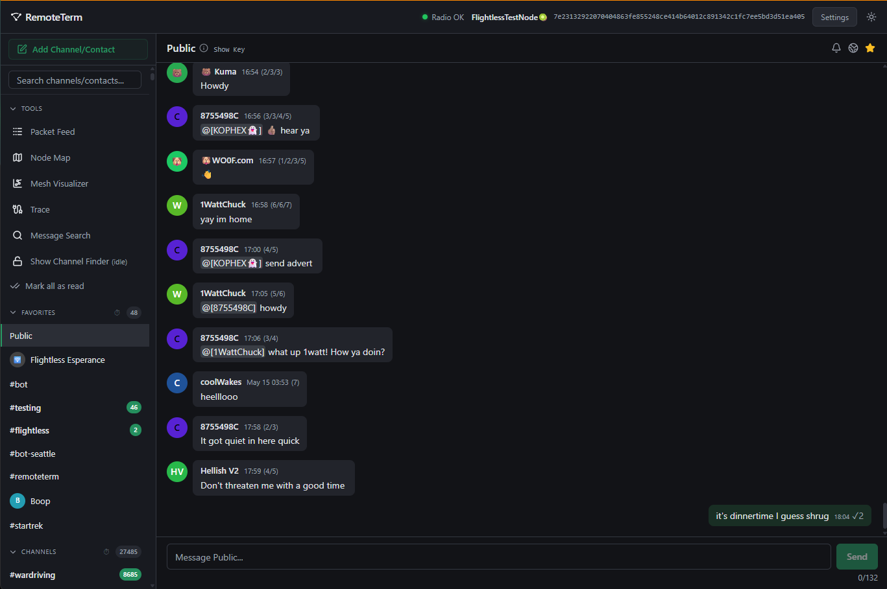

# Meshloom

[](https://github.com/bagl3y/meshloom/actions/workflows/all-quality.yml)
[](https://github.com/bagl3y/meshloom/actions/workflows/docker.yml)
[](https://github.com/bagl3y/meshloom/actions/workflows/codeql.yml)
[](https://github.com/bagl3y/meshloom/releases)
[](https://github.com/bagl3y/meshloom/pkgs/container/meshloom)
[](LICENSE.md)

> [!NOTE]
> Meshloom is a fork of [Jack Kingsman's MeshCore web client](https://github.com/jkingsman/Remote-Terminal-for-MeshCore). The history starts from [Ian Langworth's continuation](https://github.com/statico/remoteterm-meshcore) during the upstream pause.
>
> Thank you both — this project exists because of the foundation you built, and the care you put into it.
>
> The fork is here so I can follow my own ideas. The philosophy will shift a little, without getting in the way of people who already used the original client. Original copyright remains in [LICENSE.md](LICENSE.md).

Backend server + browser interface for MeshCore mesh radio networks, providing a rich, web-based power-user management and messaging system through a companion radio.

Connect your radio over Serial, TCP, or BLE, and then you can:

* Send and receive DMs and channel messages
* Cache all received packets, decrypting as you gain keys
* Run multiple Python bots that can analyze messages and respond to DMs and channels
* Monitor unlimited contacts and channels (radio limits don't apply -- packets are decrypted server-side)
* Access your radio remotely over your network or VPN
* Search for hashtag channel names for channels you don't have keys for yet
* Forward packets, messages, and automatic repeater telemetry to MQTT, Home Assistant, LetsMesh, MeshRank, SQS, Apprise, etc.
* Use the more recent 1.14+ firmwares which support multibyte pathing
* Visualize the mesh as a map or node set, view repeater stats, and more!
* Switch the UI between English and French
* Locate a node from 0-hop coverage (`#locate`) and look up directory data via CoreScope

For advanced setup and troubleshooting see [README_ADVANCED.md](README_ADVANCED.md). If you plan to contribute, read [CONTRIBUTING.md](CONTRIBUTING.md).

**Warning:** This app is for trusted environments only. _Do not put this on an untrusted network, or open it to the public._ You can optionally set `MESHCORE_BASIC_AUTH_USERNAME` and `MESHCORE_BASIC_AUTH_PASSWORD` for app-wide HTTP Basic auth, but that is only a coarse gate and must be paired with HTTPS. The bots can execute arbitrary Python code which means anyone who gets access to the app can, too. To completely disable the bot system, start the server with `MESHCORE_DISABLE_BOTS=true` — this prevents all bot execution and blocks bot configuration changes via the API. If you need stronger access control, consider using a reverse proxy like Nginx, or extending FastAPI; full access control and user management are outside the scope of this app.



> [!WARNING]
> Meshloom does *full* management of the radio, meaning that once a radio is connected, all contacts/channels will be imported and offloaded and the contacts actually synced to the device will be governed by the app. This means that Meshloom can be a poor fit for users who are looking to swap radios in and out, maintaining radio state (favorites, channels, etc.) irrespective of app usage.

## Requirements

- Python 3.11+
- Node.js LTS or current (20, 22, 24, 25) if you're not using a prebuilt release
- [UV](https://astral.sh/uv) package manager: `curl -LsSf https://astral.sh/uv/install.sh | sh`
- MeshCore radio connected via USB serial, TCP, or BLE

<details>
<summary>Finding your serial port</summary>

```bash
#######
# Linux
#######
ls /dev/ttyUSB* /dev/ttyACM*

#######
# macOS
#######
ls /dev/cu.usbserial-* /dev/cu.usbmodem*

###########
# Windows
###########
# In PowerShell:
Get-CimInstance Win32_SerialPort | Select-Object DeviceID, Caption

######
# WSL2
######
# Run this in an elevated PowerShell (not WSL) window
winget install usbipd
# restart console
# then find device ID
usbipd list
# make device shareable
usbipd bind --busid 3-8 # (or whatever the right ID is)
# attach device to WSL (run this each time you plug in the device)
usbipd attach --wsl --busid 3-8
# device will appear in WSL as /dev/ttyUSB0 or /dev/ttyACM0
```
</details>

## Install (recommended)

On Linux, the installer chooses a native systemd service or Docker and only offers radio transports that work on that host (USB / TCP / BLE). Use `bash -c` so prompts still have a terminal — do not pipe into `bash`.

```bash
/bin/bash -c "$(curl -fsSL https://get.meshloom.app)"
```

Native Linux prefers the public apt/dnf repo when it is up, then a `.deb`/`.rpm` from the latest release, then a source clone. Docker writes a compose file that pulls `ghcr.io/bagl3y/meshloom` (USB needs rootful Docker on Linux; Docker Desktop is TCP only).

## Install Path 1: Clone And Build

**This approach is recommended over Docker when the radio is on USB, due to intermittent serial communications issues on \*nix containers.**

```bash
git clone https://github.com/bagl3y/meshloom.git
cd meshloom

uv sync
cd frontend && npm install && npm run build && cd ..

uv run uvicorn app.main:app --host 0.0.0.0 --port 8000
```

Access the app at http://localhost:8000. Once the backend is running, the interactive API docs are available at http://localhost:8000/docs.

Source checkouts expect a normal frontend build in `frontend/dist`.

> [!IMPORTANT]
> `uv sync` is a required step, not an optional one. It creates an isolated `.venv` inside the checkout and installs every Python dependency there, so your distro's Python and its `apt`/`dnf` packages are never used — there is no list of `python3-*` system packages to install, and Debian/Ubuntu's PEP 668 "externally-managed-environment" restriction does not apply. If `uv run` fails with `ModuleNotFoundError: No module named 'meshcore'`, see [README_ADVANCED.md](README_ADVANCED.md#modulenotfounderror-no-module-named-meshcore).

> [!TIP]
> Running on lightweight hardware, or just don't want to build the frontend locally? After a Meshloom GitHub release exists, run `python3 scripts/setup/fetch_prebuilt_frontend.py` from a cloned checkout to unpack the prebuilt frontend into `frontend/prebuilt`, then start the app with `uv run uvicorn app.main:app --host 0.0.0.0 --port 8000`.

> [!NOTE]
> On Linux, you can also install Meshloom as a persistent `systemd` service that starts on boot and restarts automatically on failure:
>
> ```bash
> bash scripts/setup/install_service.sh
> ```
>
> For the full service workflow and post-install operations, see [README_ADVANCED.md](README_ADVANCED.md).

## Install Path 2: Docker

> **Warning:** Docker has had reports intermittent issues with serial event subscriptions. The native method above is more reliable.

Local Docker builds are architecture-native by default. On Apple Silicon Macs and ARM64 Linux hosts such as Raspberry Pi, `docker compose build` / `docker compose up --build` will produce an ARM64 image unless you override the platform.

For serial-device passthrough, use rootful Docker. In practice that usually means starting the stack with `sudo docker compose ...` unless your Docker daemon is already configured for rootful access via your user/group. Rootless Docker has been observed to fail on serial-device mappings even when the compose file itself is correct.

Create a local `docker-compose.yml` in one of two ways:

1. Copy the example file and edit it by hand:

```bash
cp docker-compose.example.yml docker-compose.yml
```

2. Or generate one interactively:

```bash
bash scripts/setup/install_docker.sh
```

> The interactive generator enables a self-signed (snakeoil) TLS certificate by default. If you accept the default, the app will be served over HTTPS and the generated compose file will include certificate mounts and an SSL command override. Decline if you prefer plain HTTP or plan to terminate TLS externally.

Your local `docker-compose.yml` is gitignored so future pulls don't overwrite your Docker settings.

The guided Docker flow offers USB serial (rootful Linux Docker) or TCP. BLE is not supported in Docker; use the native service installer for Bluetooth.

Then customize the local compose file for your transport and launch:

```bash
sudo docker compose up # add -d for background once you validate it's working
```

The database is stored in `./data/` (bind-mounted), so the container shares the same database as the native app.

To rebuild after pulling updates:

```bash
sudo docker compose pull
sudo docker compose up -d
```

> If you switched to a local build (`build: .` instead of `image:`), use `sudo docker compose up -d --build` instead — `pull` only fetches remote images.

The example file and setup script default to `ghcr.io/bagl3y/meshloom:latest` once a release image exists. Until then, build locally from your checkout. Replace

```yaml
image: ghcr.io/bagl3y/meshloom:latest
```

with:

```yaml
build: .
```

Then run:

```bash
sudo docker compose up -d --build
```

The container runs as root by default for maximum serial passthrough compatibility across host setups. On Linux, if you switch between native and Docker runs, `./data` can end up root-owned. If you do not need that serial compatibility behavior, you can enable the optional `user: "${UID:-1000}:${GID:-1000}"` line in `docker-compose.yml` to keep ownership aligned with your host user.

To stop:

```bash
sudo docker compose down
```

## Install Path 3: Portainer GitOps

Point a Portainer stack at this repository and set the Compose path to `docker-compose.dev.yaml`. Portainer clones the repo and builds the image locally — that is the supported GitOps path.

Copy [`.env.example`](.env.example) into the stack Environment section (or a local `.env` next to the compose file). Do not commit a real `.env`.

| Variable | Example | Role |
|----------|---------|------|
| `MESHLOOM_HTTP_PORT` | `8123` | Host port published to `:8000` |
| `MESHLOOM_DATA_PATH` | `/opt/docker/meshloom/data` | Host path mounted at `/app/data` |
| `MESHCORE_DATABASE_PATH` | `data/meshcore.db` | SQLite file inside the container |
| `MESHCORE_TCP_HOST` | `192.168.1.100` | Companion radio over TCP |
| `MESHCORE_TCP_PORT` | `5000` | TCP port |
| `MESHCORE_DISABLE_BOTS` | `false` | Set `true` on any network that is not fully trusted |
| `MESHCORE_VAPID_SUBJECT` | `mailto:you@example.com` | Required for iOS/Safari Web Push |

Local equivalent:

```bash
cp .env.example .env
# edit .env
docker compose -f docker-compose.dev.yaml --env-file .env up --build
```

## Updating

Your data lives in the SQLite database at `MESHCORE_DATABASE_PATH` — `data/meshcore.db` by default. Update in place rather than reinstalling from scratch, and back that file up first (stop the app, then copy it). Schema migrations run automatically on startup, so an updated app will upgrade an existing database for you.

Package (apt / dnf):

```bash
sudo apt upgrade    # Debian / Ubuntu
sudo dnf upgrade    # Fedora / Rocky / Alma
```

Clone and build:

```bash
cd meshloom
git pull
uv sync
cd frontend && npm install && npm run build && cd ..
```

If you use the prebuilt frontend instead of building it, run `python3 scripts/setup/fetch_prebuilt_frontend.py` in place of the `frontend` step. Then restart the app, or `sudo systemctl restart meshloom` if you installed the systemd service.

Docker:

```bash
sudo docker compose pull
sudo docker compose up -d
```

This keeps your `./data` bind mount, so the database survives. If you switched to a local build (`build: .`), use `sudo docker compose up -d --build` instead.

Portainer GitOps: pull/redeploy the stack so Portainer rebuilds from `docker-compose.dev.yaml`. The database stays on `MESHLOOM_DATA_PATH`.

## Standard Environment Variables

Only one transport may be active at a time. If multiple are set, the server will refuse to start.

| Variable | Default | Description |
|----------|---------|-------------|
| `MESHCORE_SERIAL_PORT` | (auto-detect) | Serial port path |
| `MESHCORE_SERIAL_BAUDRATE` | 115200 | Serial baud rate |
| `MESHCORE_TCP_HOST` | | TCP host (mutually exclusive with serial/BLE) |
| `MESHCORE_TCP_PORT` | 5000 | TCP port |
| `MESHCORE_BLE_ADDRESS` | | BLE device address (mutually exclusive with serial/TCP) |
| `MESHCORE_BLE_PIN` | | BLE PIN (required when BLE address is set) |
| `MESHCORE_LOG_LEVEL` | INFO | `DEBUG`, `INFO`, `WARNING`, `ERROR` |
| `MESHCORE_DATABASE_PATH` | `data/meshcore.db` | SQLite database path |
| `MESHCORE_DISABLE_BOTS` | false | Disable bot system entirely (blocks execution and config; an intermediate security precaution, but not as good as basic auth) |
| `MESHCORE_BASIC_AUTH_USERNAME` | | Optional app-wide HTTP Basic auth username; must be set together with `MESHCORE_BASIC_AUTH_PASSWORD` |
| `MESHCORE_BASIC_AUTH_PASSWORD` | | Optional app-wide HTTP Basic auth password; must be set together with `MESHCORE_BASIC_AUTH_USERNAME` |
| `MESHCORE_VAPID_SUBJECT` | `mailto:noreply@meshcore.local` | Subject (`sub`) claim for Web Push VAPID tokens; must be a `mailto:` or `https:` contact. Apple's push service rejects the default `.local` domain, so iOS/Safari users must set this to a real address (e.g. `mailto:you@example.com`). |

Common launch patterns:

```bash
# Serial (explicit port)
MESHCORE_SERIAL_PORT=/dev/ttyUSB0 uv run uvicorn app.main:app --host 0.0.0.0 --port 8000

# TCP
MESHCORE_TCP_HOST=192.168.1.100 MESHCORE_TCP_PORT=5000 uv run uvicorn app.main:app --host 0.0.0.0 --port 8000

# BLE
MESHCORE_BLE_ADDRESS=AA:BB:CC:DD:EE:FF MESHCORE_BLE_PIN=123456 uv run uvicorn app.main:app --host 0.0.0.0 --port 8000
```

On Windows (PowerShell), set environment variables as a separate statement:

```powershell
$env:MESHCORE_SERIAL_PORT="COM8" # or your COM port
uv run uvicorn app.main:app --host 0.0.0.0 --port 8000
```

> [!WARNING]
> **Windows + MQTT fanout:** Python's default Windows event loop (ProactorEventLoop) is not compatible with the MQTT libraries used by Meshloom. If you configure any MQTT integration, add `--loop none` to your uvicorn command:
>
> ```powershell
> uv run uvicorn app.main:app --host 0.0.0.0 --port 8000 --loop none
> ```
>
> If you forget, the app will start normally but MQTT connections will fail and you'll see a toast in the UI with this same guidance.

If you enable Basic Auth, protect the app with HTTPS. HTTP Basic credentials are not safe on plain HTTP. Also note that the app's permissive CORS policy is a deliberate trusted-network tradeoff, so cross-origin browser JavaScript is not a reliable way to use that Basic Auth gate.

## Where To Go Next

- Advanced setup, troubleshooting, HTTPS, systemd, remediation variables, and debug logging: [README_ADVANCED.md](README_ADVANCED.md)
- Home Assistant-specific guidance and entity/sensor naming schemes: [README_HA.md](README_HA.md)
- Contributing, tests, linting, E2E notes, and important AGENTS files: [CONTRIBUTING.md](CONTRIBUTING.md)
- Live API docs after the backend is running: http://localhost:8000/docs

## Disclaimer

This is developed with very heavy agentic assistance -- there is no warranty of fitness for any purpose. It's been lovingly guided by an engineer with a passion for clean code and good tests, but it's still mostly LLM output, so you may find some bugs.

If extending, have your LLM read the three `AGENTS.md` files: `./AGENTS.md`, `./frontend/AGENTS.md`, and `./app/AGENTS.md`.
